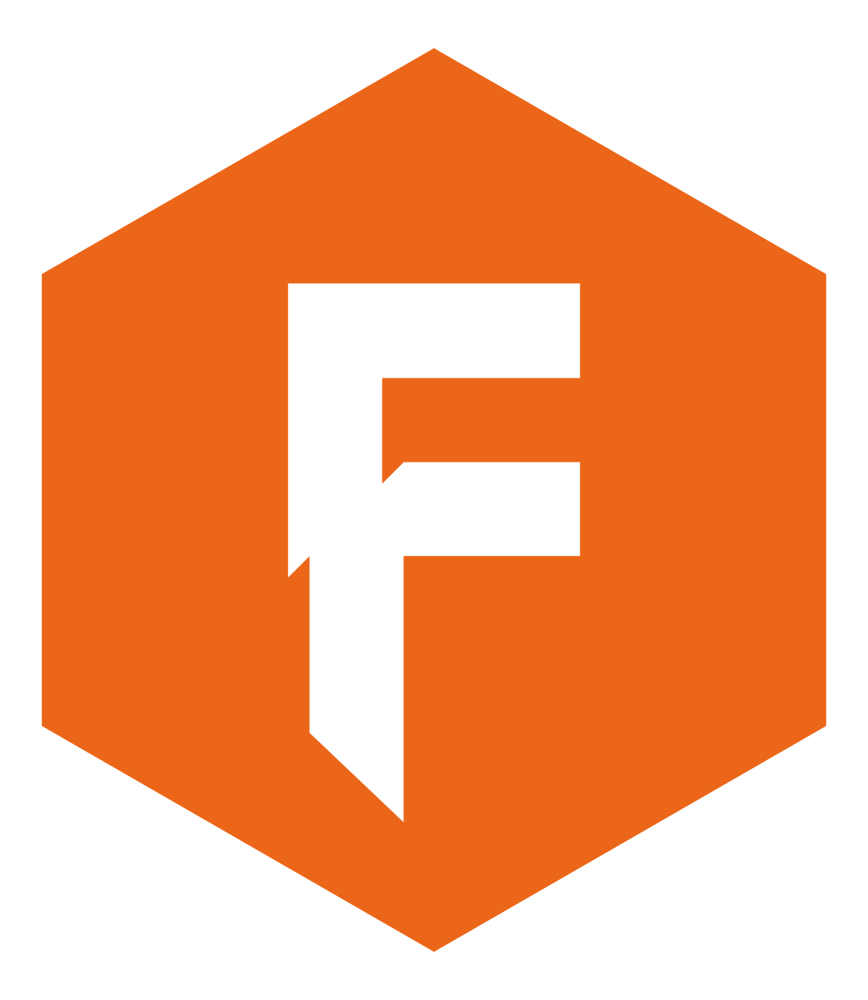

<br><br/><br/><br/>rictionless
Data - <br/>Table Schema
================

[](https://cran.r-project.org/package=tableschema.r)
[](https://travis-ci.org/frictionlessdata/tableschema-r)
[](https://coveralls.io/r/frictionlessdata/tableschema-r?branch=master)
[](https://github.com/frictionlessdata/tableschema-r/issues)
[](https://github.com/frictionlessdata/tableschema-r/pulls)
[](http://www.repostatus.org/#active)
[](https://cran.r-project.org/)
[](http://www.rdocumentation.org/packages/tableschema.r)
[](http://cran.rstudio.com/web/packages/tableschema.r/index.html)
[](https://opensource.org/licenses/MIT)
[](https://gitter.im/frictionlessdata/chat)

# Description

R library for working with [Table
Schema](http://specs.frictionlessdata.io/table-schema/).

# Features

  - `Table` class for working with data and schema
  - `Schema` class for working with schemas
  - `Field` class for working with schema fields
  - `validate` function for validating schema descriptors
  - `infer` function that creates a schema based on a data sample

# Getting started

## Installation

In order to install the latest distribution of [R
software](https://www.r-project.org/) to your computer you have to
select one of the mirror sites of the [Comprehensive R Archive
Network](https://cran.r-project.org/), select the appropriate link for
your operating system and follow the wizard instructions.

For windows users you can:

1.  Go to CRAN
2.  Click download R for Windows
3.  Click Base (This is what you want to install R for the first time)
4.  Download the latest R version
5.  Run installation file and follow the instrustions of the installer.

(Mac) OS X and Linux users may need to follow different steps depending
on their system version to install R successfully and it is recommended
to read the instructions on CRAN site carefully.

Even more detailed installation instructions can be found in [R
Installation and Administration
manual](https://cran.r-project.org/doc/manuals/R-admin.html).

To install [RStudio](https://www.rstudio.com/), you can download
[RStudio Desktop](https://www.rstudio.com/products/rstudio/download/)
with Open Source License and follow the wizard instructions:

1.  Go to [RStudio](https://www.rstudio.com/products/rstudio/)
2.  Click download on RStudio Desktop
3.  Download on RStudio Desktop free download
4.  Select the appropriate file for your system
5.  Run installation file

To install the `tableschema` library it is necessary to install first
`devtools` library to make installation of github libraries available.

``` r
# Install devtools package if not already
install.packages("devtools")
```

Install `tableschema.r`

``` r
# from CRAN version
install.packages("tableschema.r")

# or install the development version from github
devtools::install_github("frictionlessdata/tableschema-r")
```

## Load library

``` r
# Install devtools package if not already
# install.packages("jsonlite")
library(jsonlite)
# Install devtools package if not already
# install.packages("future")
library(future)
# load the library using
library(tableschema.r)
```

# Documentation

[Jsonlite package](https://CRAN.R-project.org/package=jsonlite) is
internally used to convert json data to list objects. The input
parameters of functions could be json strings, files or lists and the
outputs are in list format to easily further process your data in R
environment and exported as desired. The examples below show how to use
jsonlite package to convert the output back to json adding indentation
whitespace. More details about handling json you can see jsonlite
documentation or vignettes
[here](https://CRAN.R-project.org/package=jsonlite).

Moreover [future package](https://CRAN.R-project.org/package=future) is
also used to load and create Table and Schema classes asynchronously. To
retrieve the actual result of the loaded Table or Schema you have to use
`value(...)` to the variable you stored the loaded Table/Schema. More
details about future package and sequential and parallel processing you
can find [here](https://CRAN.R-project.org/package=future).

## Working with Table

A table is a core concept in a tabular data world. It represents a data
with a metadata (Table Schema). Let’s see how we could use it in
practice.

Consider we have some local csv file. It could be inline data or remote
link - all supported by `Table` class (except local files for in-brower
usage of course). But say it’s `data.csv` for now:

> data/cities.csv

``` csv
city,location
london,"51.50,-0.11"
paris,"48.85,2.30"
rome,N/A
```

Let’s create and read a table. We use static `Table.load` method and
`table.read` method with a `keyed` option to get list of keyed rows:

``` r
def = Table.load('inst/extdata/data.csv')
table = value(def)
# add indentation whitespace to JSON output with jsonlite package
toJSON(table$read(keyed = TRUE), pretty = TRUE) # function from jsonlite package
```

    ## [
    ##   {
    ##     "city": ["london"],
    ##     "location": ["\"51.50 -0.11\""]
    ##   },
    ##   {
    ##     "city": ["paris"],
    ##     "location": ["\"48.85 2.30\""]
    ##   },
    ##   {
    ##     "city": ["rome"],
    ##     "location": ["N/A"]
    ##   }
    ## ]

``` r
table.headers = table$headers 
table.headers
```

    ## [[1]]
    ## [1] "city"
    ## 
    ## [[2]]
    ## [1] "location"

As we could see our locations are just a strings. But it should be
geopoints. Also Rome’s location is not available but it’s also just a
`N/A` string instead of `null`. First we have to infer Table Schema:

``` r
# add indentation whitespace to JSON output with jsonlite package
toJSON(table$infer(), pretty = TRUE) # function from jsonlite package
```

    ## {
    ##   "fields": [
    ##     {
    ##       "name": ["city"],
    ##       "type": ["string"],
    ##       "format": ["default"]
    ##     },
    ##     {
    ##       "name": ["location"],
    ##       "type": ["string"],
    ##       "format": ["default"]
    ##     }
    ##   ],
    ##   "missingValues": [
    ##     [""]
    ##   ]
    ## }

``` r
toJSON(table$schema$descriptor, pretty = TRUE) # function from jsonlite package
```

    ## {
    ##   "fields": [
    ##     {
    ##       "name": ["city"],
    ##       "type": ["string"],
    ##       "format": ["default"]
    ##     },
    ##     {
    ##       "name": ["location"],
    ##       "type": ["string"],
    ##       "format": ["default"]
    ##     }
    ##   ],
    ##   "missingValues": [
    ##     [""]
    ##   ]
    ## }

``` r
table$read(keyed = TRUE) # Fails
```

Let’s fix not available location. There is a `missingValues` property in
Table Schema specification. As a first try we set `missingValues` to
`N/A` in `table$schema$descriptor`. Schema descriptor could be changed
in-place but all changes should be commited by `table$schema$commit()`:

``` r
table$schema$descriptor['missingValues'] = 'N/A'
table$schema$commit()
```

    ## [1] TRUE

``` r
table$schema$valid # false
```

    ## [1] FALSE

``` r
table$schema$errors
```

    ## [[1]]
    ## [1] "Descriptor validation error:\n            data.missingValues - is the wrong type"

As a good citiziens we’ve decided to check out schema descriptor
validity. And it’s not valid\! We sould use an list for `missingValues`
property. Also don’t forget to have an empty string as a missing value:

``` r
table$schema$descriptor[['missingValues']] = list("", 'N/A')
table$schema$commit()
```

    ## [1] TRUE

``` r
table$schema$valid # true
```

    ## [1] TRUE

All good. It looks like we’re ready to read our data again:

``` r
table$read() # or
```

``` r
toJSON(table$read(), pretty = TRUE) # function from jsonlite package
```

Now we see that:

  - locations are lists with numeric lattide and longitude

  - Rome’s location is `null`

And because there are no errors on data reading we could be sure that
our data is valid againt our schema. Let’s save it:

``` r
table$schema$save('schema.json')
table$save('data.csv')
```

Our `data.csv` looks the same because it has been stringified back to
`csv` format. But now we have `schema.json`:

``` json
{
"fields": [
{
"name": "city",
"type": "string",
"format": "default"
},
{
"name": "location",
"type": "geopoint",
"format": "default"
}
],
"missingValues": [
"",
"N/A"
]
}
```

If we decide to improve it even more we could update the schema file and
then open it again. But now providing a schema path.

``` r
def = Table.load('inst/extdata/data.csv', schema = 'inst/extdata/schema.json')
table = value(def)
table
```

    ## <Table>
    ##   Public:
    ##     clone: function (deep = FALSE) 
    ##     headers: active binding
    ##     infer: function (limit = 100) 
    ##     initialize: function (src, schema = NULL, strict = FALSE, headers = 1) 
    ##     iter: function (keyed, extended, cast = TRUE, relations = FALSE, stream = FALSE) 
    ##     read: function (keyed = FALSE, extended = FALSE, cast = TRUE, relations = FALSE, 
    ##     save: function (connection) 
    ##     schema: active binding
    ##   Private:
    ##     createRowStream_: function (src) 
    ##     createUniqueFieldsCache: function (schema) 
    ##     currentStream_: NULL
    ##     headers_: NULL
    ##     headersRow_: 1
    ##     rowNumber_: 0
    ##     schema_: Schema, R6
    ##     src: inst/extdata/data.csv
    ##     strict_: FALSE
    ##     uniqueFieldsCache_: list

It was only basic introduction to the `Table` class. To learn more let’s
take a look on `Table` class API reference.

## Working with Schema

A model of a schema with helpful methods for working with the schema and
supported data. Schema instances can be initialized with a schema source
as a url to a JSON file or a JSON object. The schema is initially
validated (see [validate](#validate) below). By default validation
errors will be stored in `schema$errors` but in a strict mode it will be
instantly raised.

Let’s create a blank schema. It’s not valid because `descriptor$fields`
property is required by the [Table
Schema](http://specs.frictionlessdata.io/table-schema/) specification:

``` r
def = Schema.load({})
schema = value(def)
schema$valid # false
```

    ## [1] FALSE

``` r
schema$errors
```

    ## [[1]]
    ## [1] "Descriptor validation error:\n            data.fields - is required"

To do not create a schema descriptor by hands we will use a
`schema$infer` method to infer the descriptor from given data:

``` r
toJSON(
  schema$infer(helpers.from.json.to.list('[
    ["id", "age", "name"],
    ["1","39","Paul"],
    ["2","23","Jimmy"],
    ["3","36","Jane"],
    ["4","28","Judy"]
    ]')), pretty = TRUE) # function from jsonlite package
```

    ## {
    ##   "fields": [
    ##     {
    ##       "name": ["id"],
    ##       "type": ["integer"]
    ##     },
    ##     {
    ##       "name": ["age"],
    ##       "type": ["integer"]
    ##     },
    ##     {
    ##       "name": ["name"],
    ##       "type": ["string"]
    ##     }
    ##   ]
    ## }

``` r
schema$valid # true
```

    ## [1] TRUE

``` r
toJSON(
  schema$descriptor,
  pretty = TRUE) # function from jsonlite package
```

    ## {
    ##   "fields": [
    ##     {
    ##       "name": ["id"],
    ##       "type": ["integer"],
    ##       "format": ["default"]
    ##     },
    ##     {
    ##       "name": ["age"],
    ##       "type": ["integer"],
    ##       "format": ["default"]
    ##     },
    ##     {
    ##       "name": ["name"],
    ##       "type": ["string"],
    ##       "format": ["default"]
    ##     }
    ##   ],
    ##   "missingValues": [
    ##     [""]
    ##   ]
    ## }

Now we have an inferred schema and it’s valid. We could cast data row
against our schema. We provide a string input by an output will be cast
correspondingly:

``` r
toJSON(
  schema$castRow(helpers.from.json.to.list('["5", "66", "Sam"]')),
  pretty = TRUE, auto_unbox = TRUE) # function from jsonlite package
```

    ## [
    ##   5,
    ##   66,
    ##   "Sam"
    ## ]

But if we try provide some missing value to `age` field cast will fail
because for now only one possible missing value is an empty string.
Let’s update our schema:

``` r
schema$castRow(helpers.from.json.to.list('["6", "N/A", "Walt"]'))
```

    ## Error in schema$castRow(helpers.from.json.to.list("[\"6\", \"N/A\", \"Walt\"]")): There are 1 cast errors (see following - Wrong type for header: age and value: N/A

``` r
# Cast error
```

``` r
schema$descriptor$missingValues = list('', 'NA')
schema$commit()
```

    ## [1] TRUE

``` r
schema$castRow(helpers.from.json.to.list('["6", "", "Walt"]'))
```

    ## [[1]]
    ## [1] 6
    ## 
    ## [[2]]
    ## NULL
    ## 
    ## [[3]]
    ## [1] "Walt"

We could save the schema to a local file. And we could continue the work
in any time just loading it from the local file:

``` r
schema$save('schema.json')
schema = Schema.load('schema.json')
```

It was only basic introduction to the `Schema` class. To learn more
let’s take a look on `Schema` class API reference.

## Working with Field

Class represents field in the schema.

Data values can be cast to native R types. Casting a value will check
the value is of the expected type, is in the correct format, and
complies with any constraints imposed by a schema.

``` json
{
"name": "birthday",
"type": "date",
"format": "default",
"constraints": {
"required": true,
"minimum": "2015-05-30"
}
}
```

Following code will not raise the exception, despite the fact our date
is less than minimum constraints in the field, because we do not check
constraints of the field descriptor

``` r
field = Field$new(helpers.from.json.to.list('{"name": "name", "type": "number"}'))
dateType = field$cast_value('12345') # cast
dateType # print the result
```

    ## [1] 12345

And following example will raise exception, because we set flag ‘skip
constraints’ to `false`, and our date is less than allowed by `minimum`
constraints of the field. Exception will be raised as well in situation
of trying to cast non-date format values, or empty values

``` r
tryCatch(
  dateType = field$cast_value(value = '2014-05-29', constraints = FALSE), 
  error = function(e){# uh oh, something went wrong
  })
```

    ## Error in private$castValue(...): Field character(0) can't cast value 2014-05-29 for type number with format default

Values that can’t be cast will raise an `Error` exception. Casting a
value that doesn’t meet the constraints will raise an `Error` exception.

Table below shows the available types, formats and resultant value of
the cast:

| Type      | Formats                     | Casting result     |
| :-------- | :-------------------------- | :----------------- |
| any       | default                     | Any                |
| list |    | default |                   | List               |
| boolean   | default                     | Boolean            |
| date      | default, any                | Date               |
| datetime  | default, any                | Date               |
| duration  | default                     | Duration           |
| geojson   | default, topojson           | Object             |
| geopoint  | default, list, object       | \[Number, Number\] |
| integer   | default                     | Number             |
| number    | default                     | Number             |
| object    | default                     | Object             |
| string    | default, uri, email, binary | String             |
| time      | default, any                | Date               |
| year      | default                     | Number             |
| yearmonth | default                     | \[Number, Number\] |

### Working with Validate

> `validate()` validates whether a **schema** is a validate Table Schema
> accordingly to the
> [specifications](https://frictionlessdata.io/schemas/table-schema.json).
> It does **not** validate data against a schema.

Given a schema descriptor `validate` returns a validation object:

``` r
valid_errors = validate('inst/extdata/schema.json')
valid_errors
```

    ## $valid
    ## [1] TRUE
    ## 
    ## $errors
    ## list()

### Working with Infer

Given data source and headers `infer` will return a Table Schema as a
JSON object based on the data values.

Given the data file, example.csv:

``` csv
id,age,name
1,39,Paul
2,23,Jimmy
3,36,Jane
4,28,Judy
```

Call `infer` with headers and values from the datafile:

``` r
descriptor = infer('inst/extdata/data_infer.csv')
```

The `descriptor` variable is now a list object that can easily converted
to JSON:

``` r
toJSON(
  descriptor,
  pretty = TRUE
) # function from jsonlite package
```

    ## {
    ##   "fields": [
    ##     {
    ##       "name": ["id"],
    ##       "type": ["integer"],
    ##       "format": ["default"]
    ##     },
    ##     {
    ##       "name": ["age"],
    ##       "type": ["integer"],
    ##       "format": ["default"]
    ##     },
    ##     {
    ##       "name": ["name"],
    ##       "type": ["string"],
    ##       "format": ["default"]
    ##     }
    ##   ],
    ##   "missingValues": [
    ##     [""]
    ##   ]
    ## }

## API Reference

### Table

Table representation

  - [Table](#Table)
      - *instance*
          - [$headers](#Table+headers) ⇒ <code>List.\<string\></code>
          - [$schema](#Table+schema) ⇒ <code>Schema</code>
          - [$iter(keyed, extended, cast, forceCast, relations,
            stream)](#Table+iter) ⇒ <code>AsyncIterator</code> |
            <code>Stream</code>
          - [$read(limit)](#Table+read) ⇒ <code>List.\<List\></code> |
            <code>List.\<Object\></code>
          - [$infer(limit)](#Table+infer) ⇒ <code>Object</code>
          - [$save(target)](#Table+save) ⇒ <code>Boolean</code>
      - *static*
          - [.load(source, schema, strict, headers,
            parserOptions)](#Table.load) ⇒ [<code>Table</code>](#Table)

#### table$headers ⇒ <code>List.\<string\></code>

Headers

**Returns**: <code>List.\<string\></code> - data source headers

#### table$schema ⇒ <code>Schema</code>

Schema

**Returns**: <code>Schema</code> - table schema instance

#### table$iter(keyed, extended, cast, forceCast, relations, stream) ⇒ <code>AsyncIterator</code> | <code>Stream</code>

Iterate through the table data

And emits rows cast based on table schema (async for loop). With a
`stream` flag instead of async iterator a Node stream will be returned.
Data casting can be disabled.

**Returns**: <code>AsyncIterator</code> | <code>Stream</code> - async
iterator/stream of rows: - `[value1, value2]` - base - `{header1:
value1, header2: value2}` - keyed - `[rowNumber, [header1, header2],
[value1, value2]]` - extended **Throws**:

  - <code>TableSchemaError</code> raises any error occurred in this
    process

| Param     | Type                 | Description                                                                                                                                                                                                                                                                           |
| --------- | -------------------- | ------------------------------------------------------------------------------------------------------------------------------------------------------------------------------------------------------------------------------------------------------------------------------------- |
| keyed     | <code>boolean</code> | iter keyed rows                                                                                                                                                                                                                                                                       |
| extended  | <code>boolean</code> | iter extended rows                                                                                                                                                                                                                                                                    |
| cast      | <code>boolean</code> | disable data casting if false                                                                                                                                                                                                                                                         |
| forceCast | <code>boolean</code> | instead of raising on the first row with cast error return an error object to replace failed row. It will allow to iterate over the whole data file even if it’s not compliant to the schema. Example of output stream: `[['val1', 'val2'], TableSchemaError, ['val3', 'val4'], ...]` |
| relations | <code>Object</code>  | object of foreign key references in a form of `{resource1: [{field1: value1, field2: value2}, ...], ...}`. If provided foreign key fields will checked and resolved to its references                                                                                                 |
| stream    | <code>boolean</code> | return Node Readable Stream of table rows                                                                                                                                                                                                                                             |

#### table$read(limit) ⇒ <code>List.\<List\></code> | <code>List.\<Object\></code>

Read the table data into memory

> The API is the same as `table.iter` has except for:

**Returns**: <code>List.\<List\></code> | <code>List.\<Object\></code> -
list of rows: - `[value1, value2]` - base - `{header1: value1, header2:
value2}` - keyed - `[rowNumber, [header1, header2], [value1, value2]]` -
extended

| Param | Type                 | Description           |
| ----- | -------------------- | --------------------- |
| limit | <code>integer</code> | limit of rows to read |

#### table$infer(limit) ⇒ <code>Object</code>

Infer a schema for the table.

It will infer and set Table Schema to `table.schema` based on table
data.

**Returns**: <code>Object</code> - Table Schema descriptor

| Param | Type                | Description            |
| ----- | ------------------- | ---------------------- |
| limit | <code>number</code> | limit rows sample size |

#### table$save(target) ⇒ <code>Boolean</code>

Save data source to file locally in CSV format with `,` (comma)
delimiter

**Returns**: <code>Boolean</code> - true on success **Throws**:

  - <code>TableSchemaError</code> an error if there is saving problem

| Param  | Type                | Description                     |
| ------ | ------------------- | ------------------------------- |
| target | <code>string</code> | path where to save a table data |

#### Table.load(source, schema, strict, headers, parserOptions) ⇒ [<code>Table</code>](#Table)

Factory method to instantiate `Table` class.

This method is async and it should be used with await keyword or as a
`Promise`. If `references` argument is provided foreign keys will be
checked on any reading operation.

**Returns**: [<code>Table</code>](#Table) - data table class instance
**Throws**:

  - <code>TableSchemaError</code> raises any error occurred in table
    creation process

| Param         | Type                                                                                           | Description                                                                                                                                                                                                      |
| ------------- | ---------------------------------------------------------------------------------------------- | ---------------------------------------------------------------------------------------------------------------------------------------------------------------------------------------------------------------- |
| source        | <code>string</code> | <code>List.\<List\></code> | <code>Stream</code> | <code>function</code> | data source (one of): - local CSV file (path) - remote CSV file (url) - list of lists representing the rows - readable stream with CSV file contents - function returning readable stream with CSV file contents |
| schema        | <code>string</code> | <code>Object</code>                                                      | data schema in all forms supported by `Schema` class                                                                                                                                                             |
| strict        | <code>boolean</code>                                                                           | strictness option to pass to `Schema` constructor                                                                                                                                                                |
| headers       | <code>number</code> | <code>List.\<string\></code>                                             | data source headers (one of): - row number containing headers (`source` should contain headers rows) - list of headers (`source` should NOT contain headers rows)                                                |
| parserOptions | <code>Object</code>                                                                            | options to be used by CSV parser. All options listed at <https://csv.js.org/parse/options/>. By default `ltrim` is true according to the CSV Dialect spec.                                                       |

### Schema

Schema representation

  - [Schema](#Schema)
      - *instance*
          - [$valid](#Schema+valid) ⇒ <code>Boolean</code>
          - [$errors](#Schema+errors) ⇒ <code>List.\<Error\></code>
          - [$descriptor](#Schema+descriptor) ⇒ <code>Object</code>
          - [$primaryKey](#Schema+primaryKey) ⇒
            <code>List.\<string\></code>
          - [$foreignKeys](#Schema+foreignKeys) ⇒
            <code>List.\<Object\></code>
          - [$fields](#Schema+fields) ⇒ <code>List.\<Field\></code>
          - [$fieldNames](#Schema+fieldNames) ⇒
            <code>List.\<string\></code>
          - [$getField(fieldName)](#Schema+getField) ⇒
            <code>Field</code> | <code>null</code>
          - [$addField(descriptor)](#Schema+addField) ⇒
            <code>Field</code>
          - [$removeField(name)](#Schema+removeField) ⇒
            <code>Field</code> | <code>null</code>
          - [$castRow(row, failFalst)](#Schema+castRow) ⇒
            <code>List.\<List\></code>
          - [$infer(rows, headers)](#Schema+infer) ⇒ <code>Object</code>
          - [$commit(strict)](#Schema+commit) ⇒ <code>Boolean</code>
          - [$save(target)](#Schema+save) ⇒ <code>boolean</code>
      - *static*
          - [.load(descriptor, strict)](#Schema.load) ⇒
            [<code>Schema</code>](#Schema)

#### schema$valid ⇒ <code>Boolean</code>

Validation status

It always `true` in strict mode.

**Returns**: <code>Boolean</code> - returns validation status

#### schema$errors ⇒ <code>List.\<Error\></code>

Validation errors

It always empty in strict mode.

**Returns**: <code>List.\<Error\></code> - returns validation errors

#### schema$descriptor ⇒ <code>Object</code>

Descriptor

**Returns**: <code>Object</code> - schema descriptor

#### schema$primaryKey ⇒ <code>List.\<string\></code>

Primary Key

**Returns**: <code>List.\<string\></code> - schema primary key

#### schema$foreignKeys ⇒ <code>List.\<Object\></code>

Foreign Keys

**Returns**: <code>List.\<Object\></code> - schema foreign keys

#### schema$fields ⇒ <code>List.\<Field\></code>

Fields

**Returns**: <code>List.\<Field\></code> - schema fields

#### schema$fieldNames ⇒ <code>List.\<string\></code>

Field names

**Returns**: <code>List.\<string\></code> - schema field names

#### schema$getField(fieldName) ⇒ <code>Field</code> | <code>null</code>

Return a field

**Returns**: <code>Field</code> | <code>null</code> - field instance if
exists

| Param     | Type                |
| --------- | ------------------- |
| fieldName | <code>string</code> |

#### schema$addField(descriptor) ⇒ <code>Field</code>

Add a field

**Returns**: <code>Field</code> - added field instance

| Param      | Type                |
| ---------- | ------------------- |
| descriptor | <code>Object</code> |

#### schema$removeField(name) ⇒ <code>Field</code> | <code>null</code>

Remove a field

**Returns**: <code>Field</code> | <code>null</code> - removed field
instance if exists

| Param | Type                |
| ----- | ------------------- |
| name  | <code>string</code> |

#### schema$castRow(row, failFalst) ⇒ <code>List.\<List\></code>

Cast row based on field types and formats.

**Returns**: <code>List.\<List\></code> - cast data row

| Param     | Type                       | Description                   |
| --------- | -------------------------- | ----------------------------- |
| row       | <code>List.\<List\></code> | data row as an list of values |
| failFalst | <code>boolean</code>       |                               |

#### schema$infer(rows, headers) ⇒ <code>Object</code>

Infer and set `schema.descriptor` based on data sample.

**Returns**: <code>Object</code> - Table Schema descriptor

| Param   | Type                                                | Description                                                                                                                                                                   |
| ------- | --------------------------------------------------- | ----------------------------------------------------------------------------------------------------------------------------------------------------------------------------- |
| rows    | <code>List.\<List\></code>                          | list of lists representing rows                                                                                                                                               |
| headers | <code>integer</code> | <code>List.\<string\></code> | data sample headers (one of): - row number containing headers (`rows` should contain headers rows) - list of headers (`rows` should NOT contain headers rows) - defaults to 1 |

#### schema$commit(strict) ⇒ <code>Boolean</code>

Update schema instance if there are in-place changes in the descriptor.

**Returns**: <code>Boolean</code> - returns true on success and false if
not modified **Throws**:

  - <code>TableSchemaError</code> raises any error occurred in the
    process

| Param  | Type                 | Description                          |
| ------ | -------------------- | ------------------------------------ |
| strict | <code>boolean</code> | alter `strict` mode for further work |

**Example**

``` r
descriptor <- '{"fields": [{"name": "field", "type": "string"}]}'
def <- Schema.load(descriptor)
schema <- value(def)
schema$getField('name')
```

    ## NULL

``` r
schema$descriptor$fields[[1]]$type
```

    ## [1] "string"

``` r
schema$descriptor$fields[[1]]$type <-'number'
schema$descriptor$fields[[1]]$type
```

    ## [1] "number"

``` r
schema$commit()
```

    ## [1] TRUE

#### schema$save(target) ⇒ <code>boolean</code>

Save schema descriptor to target destination.

**Returns**: <code>boolean</code> - returns true on success **Throws**:

  - <code>TableSchemaError</code> raises any error occurred in the
    process

| Param  | Type                | Description                     |
| ------ | ------------------- | ------------------------------- |
| target | <code>string</code> | path where to save a descriptor |

#### Schema.load(descriptor, strict) ⇒ [<code>Schema</code>](#Schema)

Factory method to instantiate `Schema` class.

This method is async and it should be used with await keyword or as a
`Promise`.

**Returns**: [<code>Schema</code>](#Schema) - returns schema class
instance **Throws**:

  - <code>TableSchemaError</code> raises any error occurred in the
    process

| Param      | Type                                      | Description                                                                                                                                                                                    |
| ---------- | ----------------------------------------- | ---------------------------------------------------------------------------------------------------------------------------------------------------------------------------------------------- |
| descriptor | <code>string</code> | <code>Object</code> | schema descriptor: - local path - remote url - object                                                                                                                                          |
| strict     | <code>boolean</code>                      | flag to alter validation behaviour: - if false error will not be raised and all error will be collected in `schema.errors` - if strict is true any validation error will be raised immediately |

### Field

Field representation

  - [Field](#Field)
      - [new Field(descriptor, missingValues)](#new_Field_new)
      - [$name](#Field+name) ⇒ <code>string</code>
      - [$type](#Field+type) ⇒ <code>string</code>
      - [$format](#Field+format) ⇒ <code>string</code>
      - [$required](#Field+required) ⇒ <code>boolean</code>
      - [$constraints](#Field+constraints) ⇒ <code>Object</code>
      - [$descriptor](#Field+descriptor) ⇒ <code>Object</code>
      - [$castValue(value, constraints)](#Field+castValue) ⇒
        <code>any</code>
      - [$testValue(value, constraints)](#Field+testValue) ⇒
        <code>boolean</code>

#### new Field(descriptor, missingValues)

Constructor to instantiate `Field` class.

**Returns**: [<code>Field</code>](#Field) - returns field class instance
**Throws**:

  - <code>TableSchemaError</code> raises any error occured in the
    process

| Param         | Type                         | Description                                     |
| ------------- | ---------------------------- | ----------------------------------------------- |
| descriptor    | <code>Object</code>          | schema field descriptor                         |
| missingValues | <code>List.\<string\></code> | an list with string representing missing values |

#### field$name ⇒ <code>string</code>

Field name

#### field$type ⇒ <code>string</code>

Field type

#### field$format ⇒ <code>string</code>

Field format

#### field$required ⇒ <code>boolean</code>

Return true if field is required

#### field$constraints ⇒ <code>Object</code>

Field constraints

#### field$descriptor ⇒ <code>Object</code>

Field descriptor

#### field$castValue(value, constraints) ⇒ <code>any</code>

Cast value

**Returns**: <code>any</code> - cast value

| Param       | Type                                     | Description   |
| ----------- | ---------------------------------------- | ------------- |
| value       | <code>any</code>                         | value to cast |
| constraints | <code>Object</code> | <code>false</code> |               |

#### field$testValue(value, constraints) ⇒ <code>boolean</code>

Check if value can be cast

| Param       | Type                                     | Description   |
| ----------- | ---------------------------------------- | ------------- |
| value       | <code>any</code>                         | value to test |
| constraints | <code>Object</code> | <code>false</code> |               |

### validate(descriptor) ⇒ <code>Object</code>

This function is async so it has to be used with `await` keyword or as a
`Promise`.

**Returns**: <code>Object</code> - returns `{valid, errors}` object

| Param      | Type                                      | Description                                                    |
| ---------- | ----------------------------------------- | -------------------------------------------------------------- |
| descriptor | <code>string</code> | <code>Object</code> | schema descriptor (one of): - local path - remote url - object |

### infer(source, headers, options) ⇒ <code>Object</code>

This function is async so it has to be used with `await` keyword or as a
`Promise`.

**Returns**: <code>Object</code> - returns schema descriptor **Throws**:

  - <code>TableSchemaError</code> raises any error occured in the
    process

| Param   | Type                                                                                           | Description                                                                                                                                                                                                      |
| ------- | ---------------------------------------------------------------------------------------------- | ---------------------------------------------------------------------------------------------------------------------------------------------------------------------------------------------------------------- |
| source  | <code>string</code> | <code>List.\<List\></code> | <code>Stream</code> | <code>function</code> | data source (one of): - local CSV file (path) - remote CSV file (url) - list of lists representing the rows - readable stream with CSV file contents - function returning readable stream with CSV file contents |
| headers | <code>List.\<string\></code>                                                                   | list of headers                                                                                                                                                                                                  |
| options | <code>Object</code>                                                                            | any `Table.load` options                                                                                                                                                                                         |

# Contributing

The project follows the [Open Knowledge International coding
standards](https://github.com/okfn/coding-standards). There are common
commands to work with the project.Recommended way to get started is to
create, activate and load the library environment. To install package
and development dependencies into active environment:

``` r
devtools::install_github("frictionlessdata/tableschema-r", dependencies = TRUE)
```

To make test:

``` r
test_that(description, {
  expect_equal(test, expected result)
})
```

To run tests:

``` r
devtools::test()
```

More detailed information about how to create and run tests you can find
in [testthat package](https://github.com/hadley/testthat).

## Changelog - News

In
[NEWS.md](https://github.com/frictionlessdata/tableschema-r/blob/master/NEWS.md)
described only breaking and the most important changes. The full
changelog could be found in nicely formatted
[commit](https://github.com/frictionlessdata/tableschema-r/commits/master)
history.
